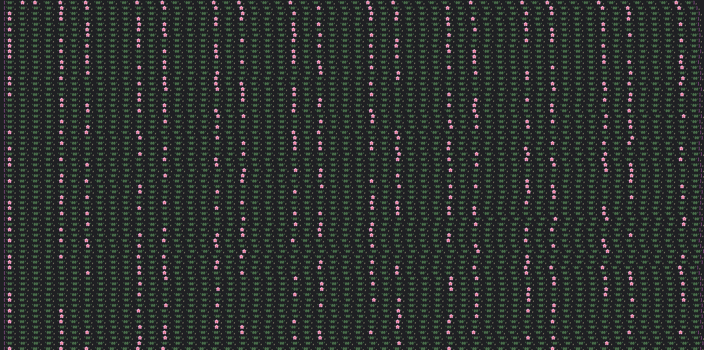

# Fun with Primes

### Table of Contents

### Tech

- Python3
- CSV module

---

## Add Functionality

- [ ] Write primes to csv instead of generating each time/ also incrementally create primes as they get larger
- [ ] FUnction to calculate rows/range
- [ ] Try to optimize prime search

---

## Data to collect/track

- [ ] Chart, headers prime/subprime rows with col lengths for comparison
- [ ] Create Cols 1-9 for comaprison
- [ ] larger then nine, digital root of cols.
- [ ] distribution down cols

### Data to track per grid

- [ ] Num of Columns
- [ ] Range, eg 1-20000
- [ ] Distribution of prime vs subprime cols
- [ ] distribution toris cols (1,2,4,5,7,8)
- [ ] distribution of digital roots

---

### Tech to consider and why

- Flask (visual representation, website)

## About this project

### Discoveries
